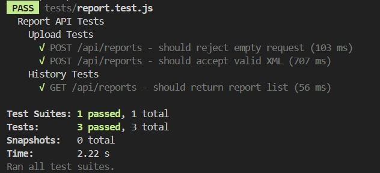

# CreditSea - Full-Stack MERN XML File Parser

## 📌 Overview  
This project is a **Full-Stack MERN application** that allows users to upload XML files, parse their content, and store the extracted data in a **MongoDB** database. The frontend provides a user-friendly interface to upload and visualize the structured XML data.

## 📽️ Video Demo  
  


## 🛠️ Tech Stack  
- **Frontend:** React, Tailwind CSS (or any UI framework)  
- **Backend:** Node.js, Express.js  
- **Database:** MongoDB  
- **Parsing Library:** xml2js (for converting XML to JSON)  

## 🚀 Features  
✔️ Upload XML files via the web interface  
✔️ Parse XML data and store it in MongoDB  
✔️ View, search, and filter parsed data  
✔️ REST API for fetching XML data  

## 📦 Setup & Installation & Tests

### 🔧 Prerequisites  
- **Node.js** & **npm** installed  
- **MongoDB** (local or cloud, e.g., MongoDB Atlas)  

### 🖥️ Backend Setup  
1. Navigate to the `backend` directory:  
   ```sh
    cd backend
2. Install dependencies:
   ```sh
   npm install
3. Create a .env file in the backend folder and add your MongoDB URI:
   ```sh
   MONGO_URI=your_mongodb_connection_string
   PORT=5000
4. Start the backend server:
   ```sh
   npm run dev
   
### 🌐 Frontend Setup
1. Navigate to the `frontend` directory:  
   ```sh
    cd frontend
2. Install dependencies:
   ```sh
   npm install
3. Start the frontend server:
   ```sh
   npm run dev
   
### 🧪 Running Tests
1. Navigate to the `backend` directory:  
   ```sh
    cd backend
2. Run the tests::
   ```sh
   npm test


## 🛠️ API Endpoints  

| Method | Endpoint  | Description             |
|--------|----------|-------------------------|
| POST   | `/upload` | Upload & parse XML file |
| GET    | `/data`   | Retrieve parsed XML data |
